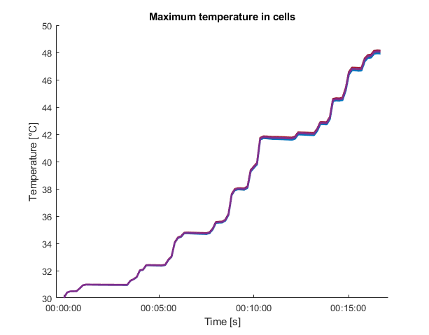

# Heat transfer in a e-motorbike’s battery pack modeled in Q-Bat 

This repository shows how to model transfer in a e-motorbike’s battery pack in Q-Bat from QuickerSim. The model consists 102 groups of 21700 Li-ion cells (17s6p), terminals, connectors, holders and casing and is connected to a reduced-order model (ROM) to model heat transfer in 3D geometry.

### :arrow_down: Please use this link instead of the download button: [Download link]() :arrow_down:

Run battery_pack_17S6P.m to get started 
* Please visit the [Q-Bat](https://www.mathworks.com/products/connections/product_detail/quickersim-q-bat.html) and [QuickerSim](https://emobility.quickersim.com/) 
page to learn more about modeling heat transfer in 3-D systems.

## **Simulation Model**

## **Simulation Model in Simulink**

